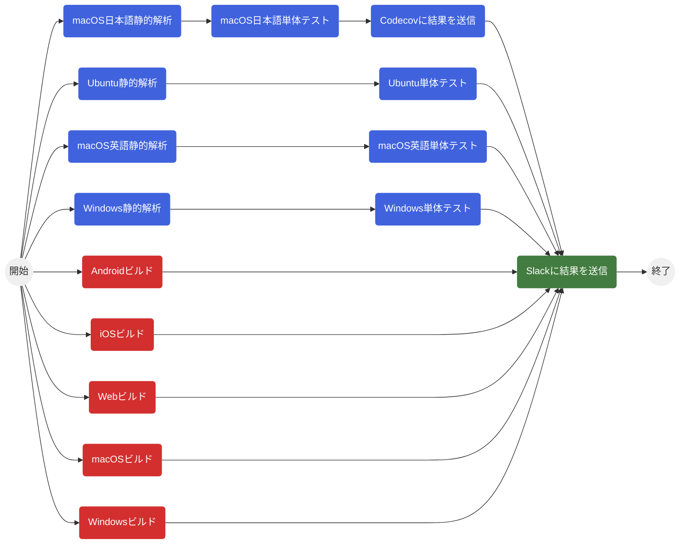

<p align="center">
<a href="https://github.com/susatthi/github-search/actions/workflows/flutter_ci.yaml"></a>
<a href="https://codecov.io/gh/susatthi/github-search"></a>
<a href="https://opensource.org/licenses/MIT"></a>

</p>

# GitHub Search

[GitHub API](https://docs.github.com/ja/rest) を利用して GitHub のリポジトリを検索するアプリです。[株式会社ゆめみのFlutterエンジニアコードチェック](https://github.com/yumemi-inc/flutter-engineer-codecheck)の要件を満たすよう実装しています。

本アプリを通して自分なりの最適なアーキテクチャを確立し、リファレンスコードにすることを目的にしています。

> **:warning: 注意**  
> このアプリは `GitHub API` を利用するために GitHub の `アクセストークン` をアプリの内部でハードコーディングして保持する構成になっています。このアプリを公開すると悪意のある者に `アクセストークン` を抜き取られ悪用される恐れがありますのでお控え下さい。もちろん、手元でビルドして動かすことは問題ありません。

一覧(Light)|一覧(Dark)
--|--
|

デスクトップ|タブレット
--|--
|


詳細|0件|エラー
--|--|--
||


## ビルド方法

#### ソースコードを clone
  
```bash
git clone https://github.com/susatthi/github-search.git
```

#### GitHub の個人アクセストークンを取得

本アプリで使用する GitHub の[個人アクセストークン](https://docs.github.com/ja/authentication/keeping-your-account-and-data-secure/creating-a-personal-access-token)を取得して、カレントディレクトリで次のコマンドを実行してください。

```bash
# 引数で与えられた環境変数を基にビルドに必要な `lib/config/env.dart` を作成してくれます。
# 作成された `lib/config/env.dart` を直接編集しても大丈夫です。

bin/flutter_env -g [GitHub 個人アクセストークン] -s [検索文字列の初期値]
```

|パラメータ                     |          |説明                                                       |
|-----------------------------|----------|----------------------------------------------------------|
|`-g`                         |`Must`    |値には [GitHub 個人アクセストークン](https://docs.github.com/ja/authentication/keeping-your-account-and-data-secure/creating-a-personal-access-token) を設定してください。|
|`-s`                         |`Optional`|値には好きな文字列を設定してください。指定しない場合は空文字が設定されます。|
|`-h`                         |          |ヘルプを表示します。                                          |

#### ビルド

Configurations を選択してビルドしてください。

|Configurations 名 |説明                       |
|------------------|--------------------------|
|`app-debug`       |アプリ向けデバッグビルド      |
|`app-release`     |アプリ向けリリースビルド      |
|`web-debug`       |Web 向けデバッグビルド       |

## 技術スタック

- アプリの機能
  - GitHub リポジトリの検索と詳細表示
  - 検索結果の並び替えと [hive](https://pub.dev/packages/hive) を使ったデータの永続化
  - Sliver を使った無限スクロール対応
  - [isar](https://isar.dev/) を使った検索履歴の保存とサジェスト
- [go_router](https://pub.dev/packages/go_router) と [go_router_builder](https://pub.dev/packages/go_router_builder) を使ったルーティング
- [http](https://pub.dev/packages/http) を使った REST API の実装
- [fast_i18n](https://pub.dev/packages/fast_i18n) を使った多言語対応（日本語/英語）
- カスタムフォント対応
- [mocktail](https://pub.dev/packages/mocktail) を使った Unit / Widget テスト
- [flutter_launcher_icons](https://pub.dev/packages/flutter_launcher_icons) を使ったアプリアイコン
- [flutter_native_splash](https://pub.dev/packages/flutter_native_splash) を使ったスプラッシュ画面
- [responsive_framework](https://pub.dev/packages/responsive_framework) を使ったレスポンシブ対応
- [GitHub Actions](https://github.co.jp/features/actions) によるCI(自動テストと自動ビルド)
- ダークモード対応
- サポートするプラットフォーム
  - iOS / Android / Web / macOS / Windows

### 今後対応予定

- Integration テスト
- Riverpod 2 対応

### 対応しないこと

- Firebase 連携
- Flavor 対応（develop / staging / production などの環境分け）

## アーキテクチャ / パッケージ

- [flutter_riverpod](https://pub.dev/packages/flutter_riverpod) + [state_notifier](https://pub.dev/packages/state_notifier) + [freezed](https://pub.dev/packages/freezed) + [go_router](https://pub.dev/packages/go_router)
- [CODE WITH ANDREA](https://codewithandrea.com/articles/flutter-app-architecture-riverpod-introduction/) と [DDD](https://little-hands.hatenablog.com/entry/2018/12/10/ddd-architecture) のアーキテクチャを参考にして、本アプリは下記の３層アーキテクチャで実装しています。


### プレゼンテーション層

#### Widgets

ページや UI 部品の Widget クラス群。States を監視して UI に表現する。ユーザーイベントを検知してコントローラーのメソッドを呼び出す。キャッシュが効かなくなるので直接 Repository Interfaces を呼び出してはいけない。

#### Controllers

Repository Interfaces を呼び出して Entities を受け取って States を更新する。Widgets からのメソッド呼び出しや、依存する States の更新を契機に発火する。ドメイン層に依存するがインフラストラクチャ層には依存してはいけない。

#### States

アプリのあらゆる状態。Entities そのものでもよいし、プレゼンテーション層内で定義した状態クラスでもよい。`Provider` 等でラップされ Widgets や他の States から参照される。

### ドメイン層

#### Entities

ユーザーなどの実体。入力値のバリデーションはエンティティで実装しインフラストラクチャ層が呼び出す。どこにも依存しないこと。

#### Repository Interfaces

データの永続化をになうリポジトリ層のインターフェース。どこにも依存しないこと。インフラストラクチャ層が投げる例外はドメイン層で定義する。

### インフラストラクチャ層

#### Repository Implements

Repository Interfaces の実体。Data Sources を利用してデータの永続化を行う。

#### Data Sources

様々なデータソース。API だったり、Hive だったり、SharedPreferences だったり、Isar だったりする。

### Riverpod の依存関係図

- [riverpod_graph](https://github.com/rrousselGit/riverpod/tree/master/packages/riverpod_graph) を使って Riverpod の依存関係図を出力してみました。

```mermaid
flowchart TB
  subgraph Arrows
    direction LR
    start1[ ] -..->|read| stop1[ ]
    style start1 height:0px;
    style stop1 height:0px;
    start2[ ] --->|listen| stop2[ ]
    style start2 height:0px;
    style stop2 height:0px; 
    start3[ ] ===>|watch| stop3[ ]
    style start3 height:0px;
    style stop3 height:0px; 
  end

  subgraph Type
    direction TB
    ConsumerWidget((widget));
    Provider[[provider]];
  end
  _MockPage((_MockPage));
  searchReposQueryProvider -.-> _MockPage;
  searchReposEnteringQueryProvider -.-> _MockPage;
  HyperlinkText((HyperlinkText));
  urlLauncherStateProvider -.-> HyperlinkText;
  SliverRepoDetailView((SliverRepoDetailView));
  selectedRepoProvider ==> SliverRepoDetailView;
  _IconLabel((_IconLabel));
  urlLauncherStateProvider -.-> _IconLabel;
  SearchReposQueryTextButton((SearchReposQueryTextButton));
  searchReposQueryProvider -.-> SearchReposQueryTextButton;
  SliverRepoListView((SliverRepoListView));
  searchReposStateProvider ==> SliverRepoListView;
  _LastIndicator((_LastIndicator));
  searchReposStateProvider -.-> _LastIndicator;
  SearchReposSortSelectorBottomSheet((SearchReposSortSelectorBottomSheet));
  searchReposSortProvider ==> SearchReposSortSelectorBottomSheet;
  searchReposSortProvider -.-> SearchReposSortSelectorBottomSheet;
  SearchReposOrderToggleButton((SearchReposOrderToggleButton));
  searchReposStateProvider ==> SearchReposOrderToggleButton;
  SearchReposOrderToggleButtonInternal((SearchReposOrderToggleButtonInternal));
  searchReposOrderProvider ==> SearchReposOrderToggleButtonInternal;
  searchReposOrderProvider -.-> SearchReposOrderToggleButtonInternal;
  SliverQueryHistoriesListView((SliverQueryHistoriesListView));
  queryHistoriesProvider ==> SliverQueryHistoriesListView;
  _QueryHistoryListTile((_QueryHistoryListTile));
  queryHistoriesProvider -.-> _QueryHistoryListTile;
  searchReposQueryProvider -.-> _QueryHistoryListTile;
  AvatarPreviewView((AvatarPreviewView));
  selectedRepoProvider ==> AvatarPreviewView;
  _AvatarPreviewView((_AvatarPreviewView));
  cachedCircleAvatarCacheManagerProvider ==> _AvatarPreviewView;
  RepoFullNameText((RepoFullNameText));
  selectedRepoProvider ==> RepoFullNameText;
  ReadmeMarkdown((ReadmeMarkdown));
  readmeContentProviderFamily ==> ReadmeMarkdown;
  ReadmeMarkdownInternal((ReadmeMarkdownInternal));
  readmeMarkdownCacheManagerProvider ==> ReadmeMarkdownInternal;
  urlLauncherStateProvider -.-> ReadmeMarkdownInternal;
  _GitHubSearchApp((_GitHubSearchApp));
  themeProvider ==> _GitHubSearchApp;
  themeProvider ==> _GitHubSearchApp;
  routerProvider ==> _GitHubSearchApp;
  urlLauncherStateProvider --> _GitHubSearchApp;
  searchReposQueryProvider[[searchReposQueryProvider]];
  queryHistoryRepositoryProvider ==> searchReposQueryProvider;
  searchReposInitQueryProvider ==> searchReposQueryProvider;
  searchReposEnteringQueryProvider[[searchReposEnteringQueryProvider]];
  searchReposQueryProvider ==> searchReposEnteringQueryProvider;
  isarQueryHistoryRepositoryProvider[[isarQueryHistoryRepositoryProvider]];
  isarProvider ==> isarQueryHistoryRepositoryProvider;
  isarProvider[[isarProvider]];
  githubHttpClientProvider[[githubHttpClientProvider]];
  githubAccessTokenProvider ==> githubHttpClientProvider;
  httpClientProvider ==> githubHttpClientProvider;
  githubAccessTokenProvider[[githubAccessTokenProvider]];
  httpClientProvider[[httpClientProvider]];
  githubRepoRepositoryProvider[[githubRepoRepositoryProvider]];
  githubApiProvider ==> githubRepoRepositoryProvider;
  githubHttpClientProvider ==> githubRepoRepositoryProvider;
  githubApiProvider[[githubApiProvider]];
  urlLauncherStateProvider[[urlLauncherStateProvider]];
  selectedRepoProvider[[selectedRepoProvider]];
  queryHistoryRepositoryProvider[[queryHistoryRepositoryProvider]];
  searchReposInitQueryProvider[[searchReposInitQueryProvider]];
  searchReposStateProvider[[searchReposStateProvider]];
  repoRepositoryProvider ==> searchReposStateProvider;
  searchReposQueryProvider ==> searchReposStateProvider;
  searchReposSortProvider ==> searchReposStateProvider;
  searchReposOrderProvider ==> searchReposStateProvider;
  selectedRepoProviderFamily[[selectedRepoProviderFamily]];
  repoRepositoryProvider ==> selectedRepoProviderFamily;
  repoRepositoryProvider[[repoRepositoryProvider]];
  searchReposSortProvider[[searchReposSortProvider]];
  appDataRepositoryProvider ==> searchReposSortProvider;
  appDataRepositoryProvider[[appDataRepositoryProvider]];
  searchReposOrderProvider[[searchReposOrderProvider]];
  appDataRepositoryProvider ==> searchReposOrderProvider;
  queryHistoriesProvider[[queryHistoriesProvider]];
  queryHistoryRepositoryProvider ==> queryHistoriesProvider;
  searchReposEnteringQueryProvider ==> queryHistoriesProvider;
  cachedCircleAvatarCacheManagerProvider[[cachedCircleAvatarCacheManagerProvider]];
  readmeContentProviderFamily[[readmeContentProviderFamily]];
  repoRepositoryProvider ==> readmeContentProviderFamily;
  readmeMarkdownCacheManagerProvider[[readmeMarkdownCacheManagerProvider]];
  themeProvider[[themeProvider]];
  routerProvider[[routerProvider]];
```



## フォルダ構成

```  
├── domain                                   ドメイン層
│   ├── entities                             ドメイン層で共通のエンティティクラス
│   ├── exceptions.dart                      例外クラス
│   └── repositories
│       └── <feature>
│           ├── <feature>_repository.dart    リポジトリのインターフェースクラス
│           └── entities                     機能単位のエンティティ
├── infrastructure                           インフラストラクチャ層
│   └── <data_sources>
│       └── <feature>
│           └── <feature>_repository.dart    リポジトリの実装
├── presentation
│   ├── app.dart                             アプリケーション
│   ├── components                           プレゼンテーション層で共通の Widget、Controller、状態
│   └── pages
│       └── <feature>
│           ├── components                   画面単位の Widget、Controller、状態
│           └── <feature>_<curd>_page.dart   画面Widget
└── utils                                    拡張機能、ロガー、言語ファイル、環境変数などのユーティリティクラス
```

## 環境

|                | Version                          |
|----------------|----------------------------------|
| Flutter        | 3.3.2                            |
| Dart           | 2.18.1                           |

### コードの自動生成

- `localizations/*.json` ファイルを変更した場合や `freezed` を使った `dart` ファイルを変更した場合は次のコマンドを実行してください。

```bash
make build-runner
```

### 単体テスト（UnitTest / WidgetTest）

- ローカルで単体テストを行うためには事前に次のライブラリをインストールしてください。

```bash
# lcov のインストール
brew install lcov

# dart_dot_reporter のインストール
flutter pub global activate dart_dot_reporter
```

- 次のコマンドで単体テスト（静的解析 => テスト => カバレッジの結果を表示 ）を実行します。

```bash
# 言語設定が英語のテスト
make test-en

# 言語設定が日本語のテスト
make test-ja
```

### API ドキュメント

- [API ドキュメント](https://susatthi.github.io/github-search/) で公開しています。

- 生成する場合は次のコマンドを実行してください。

```bash
make dartdoc
```

## CI

- [GitHub Actions](https://github.co.jp/features/actions) を利用して CI を構築しています。
  - プルリクエストが作成や更新された時、もしくは `main` または `develop` ブランチに `push` されたときに CI が発火します。



## ライセンス

MIT
