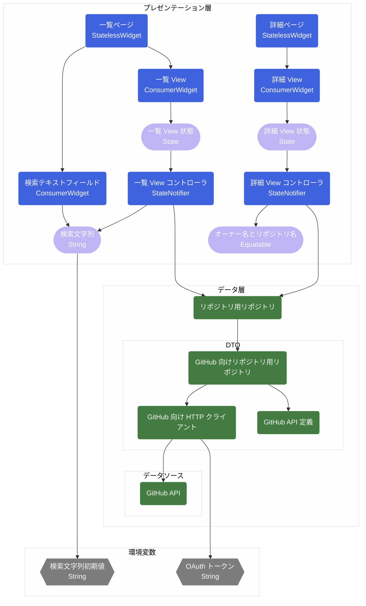
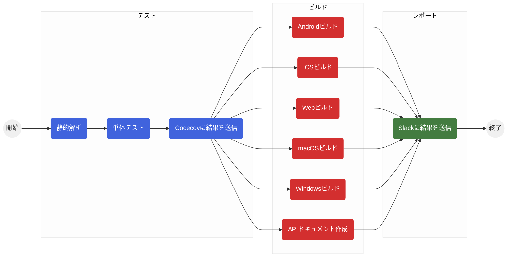

[](https://codecov.io/gh/keyber-inc/github_search)

# GitHub Search

[GitHub API](https://docs.github.com/ja/rest) を利用して GitHub のリポジトリを検索するアプリです。[株式会社ゆめみのFlutterエンジニアコードチェック](https://github.com/yumemi-inc/flutter-engineer-codecheck)の要件を満たすよう実装しています。

本アプリを通して自分なりの最適なアーキテクチャを確立し、リファレンスコードにすることを目的にしています。


## アプリの機能

- シンプルな UI / UX
  - GitHub リポジトリの検索と詳細表示
  - 無限スクロール対応
- [go_router](https://pub.dev/packages/go_router) を使った新しいルーティング
- [http](https://pub.dev/packages/http) を使った REST API の実装
- 多言語対応（日本語/英語）
- カスタムフォント対応
- [mockito](https://pub.dev/packages/mockito) を使った Unit / Widget テスト
- [flutter_launcher_icons](https://pub.dev/packages/flutter_launcher_icons) を使ったアプリアイコン
- [flutter_native_splash](https://pub.dev/packages/flutter_native_splash) を使ったスプラッシュ画面
- [GitHub Actions](https://github.co.jp/features/actions) による自動テストと自動ビルド
- サポートするプラットフォーム
  - iOS / Android / Web / macOS / Windows

### 今後対応予定

- [hive](https://pub.dev/packages/hive) or [shared_preferences](https://pub.dev/packages/shared_preferences) の利用
- CD
- Integration テスト
- テーマ対応
- ダークモード対応
- よりよい UI / UX

### 対応しないこと

- Firebase 連携
- Flavor 対応（develop / staging / production などの環境分け）

## アーキテクチャ / パッケージ

- [flutter_riverpod](https://pub.dev/packages/flutter_riverpod) + [state_notifier](https://pub.dev/packages/state_notifier) + [freezed](https://pub.dev/packages/freezed) + [go_router](https://pub.dev/packages/go_router)
- [CODE WITH ANDREA](https://codewithandrea.com/articles/flutter-app-architecture-riverpod-introduction/) の下記アーキテクチャを参考にしています。本アプリでは、Application Layer は省略しています。


- 本アプリの依存関係図です。



- `一覧 View`が更新される例
  - `一覧 View`の依存関係は、`一覧 View` → `一覧 View 状態` → `一覧 View コントローラ` → `検索文字列`となっています。ユーザが検索文字列を変更し検索を実行した場合、`検索文字列`が更新されます。すると`検索文字列`に依存している`一覧 View コントローラ`が更新され、`リポジトリ用リポジトリ`に`検索文字列`を与えてリポジトリの検索を実行し、その結果をもとに`一覧 View 状態`を更新します。すると`一覧 View 状態`に依存している`一覧 View`がリビルドされて再描画されます。
- `詳細 View`への画面遷移の例
  - `一覧 View`の`ListTile`がタップされると`オーナー名とリポジトリ名`を表示したい内容に更新して`詳細ページ`に画面遷移します。`詳細画面`が開くと`詳細 View`がビルドされ、`詳細 View コントローラ`も作成されます。`詳細 View コントローラ`は`オーナー名とリポジトリ名`を`リポジトリ用リポジトリ`に与えてリポジトリの取得を実行し、その結果をもとに`詳細 View 状態`を更新します。すると`詳細 View 状態`に依存している`詳細 View`がリビルドされて再描画されます。

## フォルダ構成

|フォルダ名                  | 説明
|----------------------------|--
| / `assets`                    | `assets`にアクセスする自動生成されるユーティリティクラス
| / `config`                    | アプリケーション、定義値、環境変数
| / `entities`                  | モデル層のファイル<br>リポジトリの戻り値に使うエンティティ<br>プレゼンテーション層で使うエンティティ（`_data` suffix がつく）
| / `localizations`             | 言語ファイル（`arb` ファイル）、`flutter gen-l10n` で生成されるクラス
| / `presentation` / `pages`    | プレゼンテーション層のファイル<br>画面Widget
| / `presentation` / `widgets`  | プレゼンテーション層のファイル<br>部品Widget、Controller、State
| / `repositories`              | データ層のファイル<br>リポジトリ、データソース<br>データソースはサブディレクトリで管理
| / `utils`                     | 拡張機能、ロガーなど便利クラス

## 環境

|                | Version                          |
|----------------|----------------------------------|
| Xcode          | 13.3                             |
| Android Studio | Bumblebee 2021.1.1 Patch 2       |
| Flutter        | 2.10.3                           |
| Swift          | 5.6                              |
| Kotlin         | 1.6.10                           |
| Chrome         | 99                               |

## 対象 OSバージョン

|        | OS Version    |
|--------|---------------|
|iOS     | 9.0 ~ 15.4    |
|Android | 8.0 ~ 13      |


## ビルド方法

- カレントディレクトリで下記コマンドを実行してください。
  - `bin/flutter_env` は引数で与えられた環境変数を基にビルドに必要な `lib/src/config/env.dart` を作成してくれます。
  - 作成された `lib/src/config/env.dart` を直接編集しても大丈夫です。

```shell
bin/flutter_env -g [GitHub OAuth トークン] -s [検索文字列の初期値]
```

|パラメータ名                   |          |説明                                                       |
|-----------------------------|----------|----------------------------------------------------------|
|`-g [GitHub OAuth トークン]`  |`Must`    |値には [GitHub 個人アクセストークン](https://docs.github.com/ja/authentication/keeping-your-account-and-data-secure/creating-a-personal-access-token) を設定してください。|
|`-s [検索文字列の初期値]`       |`Optional`|好きな文字列を設定してください。指定しない場合は空文字が設定されます。|
|`-h`                         |          |ヘルプを表示します。                                          |

- Configurations を選択してビルドしてください

|Configurations 名 |説明                       |
|------------------|--------------------------|
|`app`             |アプリ（iOS / Android）向け |
|`web`             |Web 向け                   |

### コードの自動生成

- `arb` ファイルを変更した場合や `freezed` を使った `dart` ファイルを変更した場合は下記コマンドを実行してください。

```shell
bin/flutter_gen
```

### テスト

- ローカルでテストを行う場合は下記コマンドを実行してください。
  - 静的解析 => テスト => カバレッジの結果を表示 を行います。

```shell
bin/flutter_test
```

### ドキュメント

- API ドキュメントを生成する場合は下記コマンドを実行してください。

```shell
bin/dartdoc
```

## CI / CD

- [GitHub Actions](https://github.co.jp/features/actions) を利用して CI / CD を構築しています。
  - プルリクエストが作成や更新された時、もしくは `main` または `develop` ブランチに `push` されたときに CI / CD が発火します。



## ライセンス

MIT
